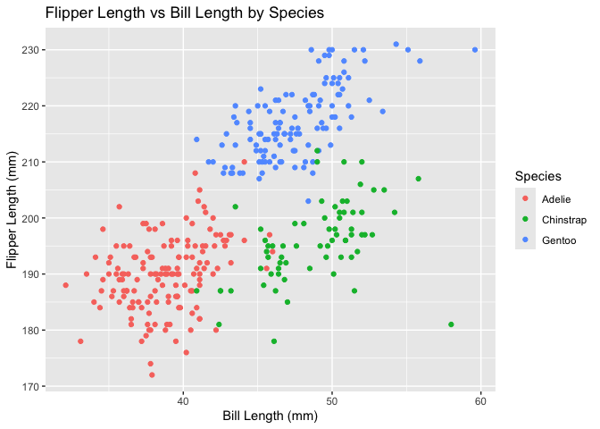

p8105_hw1_rd3096
================
Ruicong(Timothy) Du
2024-09-15

\#problem 1

\##load the penguins dataset

``` r
library(ggplot2)
data("penguins", package = "palmerpenguins")
```

\##show structure of the dataset for variables and their values

``` r
str(penguins)
```

    ## tibble [344 × 8] (S3: tbl_df/tbl/data.frame)
    ##  $ species          : Factor w/ 3 levels "Adelie","Chinstrap",..: 1 1 1 1 1 1 1 1 1 1 ...
    ##  $ island           : Factor w/ 3 levels "Biscoe","Dream",..: 3 3 3 3 3 3 3 3 3 3 ...
    ##  $ bill_length_mm   : num [1:344] 39.1 39.5 40.3 NA 36.7 39.3 38.9 39.2 34.1 42 ...
    ##  $ bill_depth_mm    : num [1:344] 18.7 17.4 18 NA 19.3 20.6 17.8 19.6 18.1 20.2 ...
    ##  $ flipper_length_mm: int [1:344] 181 186 195 NA 193 190 181 195 193 190 ...
    ##  $ body_mass_g      : int [1:344] 3750 3800 3250 NA 3450 3650 3625 4675 3475 4250 ...
    ##  $ sex              : Factor w/ 2 levels "female","male": 2 1 1 NA 1 2 1 2 NA NA ...
    ##  $ year             : int [1:344] 2007 2007 2007 2007 2007 2007 2007 2007 2007 2007 ...

## description of the dataset

The penguins dataset contains information on penguins from the Palmer
Archipelago, Antarctica. The dataset consists of 344 rows and 8 columns.

The key variables and values are: *species: The species of penguins
(Adelie, Chinstrap, Gentoo). *island: The island where the penguins were
observed (Biscoe, Dream, Torgersen). *bill_length_mm: The length of
penguin bills in millimeters. *flipper_length_mm: The length of penguin
flippers in millimeters. *body_mass_g: The body mass of penguins in
grams. *sex: The sex of the penguins (male or female).

The mean flipper length is 200.92 mm.

\##Make a scatterplot for flipper length vs bill length

``` r
ggplot(penguins, aes(x = bill_length_mm, y = flipper_length_mm, color = species)) +
  geom_point() +
  labs(
    title = "Flipper Length vs Bill Length by Species",
    x = "Bill Length (mm)",
    y = "Flipper Length (mm)",
    color = "Species"
  ) 
```

<!-- -->

\#problem 2

## load neccessary library

``` r
library(tidyverse)
```

    ## ── Attaching core tidyverse packages ──────────────────────── tidyverse 2.0.0 ──
    ## ✔ dplyr     1.1.4     ✔ readr     2.1.5
    ## ✔ forcats   1.0.0     ✔ stringr   1.5.1
    ## ✔ lubridate 1.9.3     ✔ tibble    3.2.1
    ## ✔ purrr     1.0.2     ✔ tidyr     1.3.1
    ## ── Conflicts ────────────────────────────────────────── tidyverse_conflicts() ──
    ## ✖ dplyr::filter() masks stats::filter()
    ## ✖ dplyr::lag()    masks stats::lag()
    ## ℹ Use the conflicted package (<http://conflicted.r-lib.org/>) to force all conflicts to become errors

\##create the data frame

``` r
set.seed(1)
frame_df=tibble(
  vec_numeric=rnorm(10),
  vec_logical=rnorm(10)>0,
  vec_char=letters[1:10],
  vec_factor=factor(rep(c("level1", "level2", "level3"), length.out = 10))
)

print(frame_df)
```

    ## # A tibble: 10 × 4
    ##    vec_numeric vec_logical vec_char vec_factor
    ##          <dbl> <lgl>       <chr>    <fct>     
    ##  1      -0.626 TRUE        a        level1    
    ##  2       0.184 TRUE        b        level2    
    ##  3      -0.836 FALSE       c        level3    
    ##  4       1.60  FALSE       d        level1    
    ##  5       0.330 TRUE        e        level2    
    ##  6      -0.820 FALSE       f        level3    
    ##  7       0.487 FALSE       g        level1    
    ##  8       0.738 TRUE        h        level2    
    ##  9       0.576 TRUE        i        level3    
    ## 10      -0.305 TRUE        j        level1

\##take the mean of each variable

``` r
mean_numeric=mean(pull(frame_df,vec_numeric))
mean_logical=mean(pull(frame_df,vec_logical))
mean_char=tryCatch(mean(pull(frame_df,vec_char)), error = function(e) e)
mean_factor=tryCatch(mean(pull(frame_df,vec_factor)), error = function(e) e)
```

The mean of the numeric vector is 0.1322028.

The mean of the logical vector is 0.6.

For the character vector, attempting to calculate the mean results in:
NA.

For the factor vector, attempting to calculate the mean results in: NA.

\##Explanation for what mean works and what doesnot

1.mean_numeric: This will calculate the mean of vec_numeric, which is a
numeric vector. This will work because the values are numeric.

2.mean_logical: This will calculate the mean of vec_logical. Logical
vectors are treated as 1 (TRUE) and 0 (FALSE), so the mean will
represent the proportion of TRUE values.

3.mean_char: This will fail because the vec_char is a character vector,
and r cannot calculate a mean for characters.

4.mean_factor: This will also fail because factors are categorical
variables. and r cannot calculate a mean for characters.

## Explicit conversion to numeric

``` r
as.numeric(frame_df$vec_char) 
```

    ## Warning: NAs introduced by coercion

``` r
as.numeric(frame_df$vec_factor)
```

\##Explaination for coercion and convertion:

1.Character to numeric conversion leads to NAs because characters can’t
be interpreted as numbers.Because characters like “a”, “b”, etc. cannot
be converted to numbers.

2.Factor to numeric conversion works by converting each factor level to
its corresponding numeric code.
